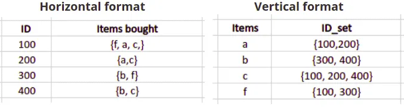

# ECLAT Algorithm

The ECLAT algorithm stands for **Equivalence Class Clustering and bottom-up Lattice Traversal**. It is one of the popular methods of Association Rule mining. It is a more efficient and scalable version of the Apriori algorithm. While the Apriori algorithm works in a horizontal sense imitating the Breadth-First Search of a graph, the ECLAT algorithm works in a vertical manner just like the Depth-First Search of a graph.

Here’s an example of transactions datasets stored in both formats:

This vertical approach of the ECLAT algorithm makes it faster than the Apriori and FP-growth algorithms as it scans the database only once. The Apriori algorithm scans the database every single iteration, and the FP-growth algorithm does it two times.

## How the algorithm work?

The basic idea is to use Transaction Id Sets(tidsets) intersections to compute the support value of a candidate and avoiding the generation of subsets which do not exist in the prefix tree. In the first call of the function, all single items are used along with their tidsets. Then the function is called recursively and in each recursive call, each item-tidset pair is verified and combined with other item-tidset pairs. This process is continued until no candidate item-tidset pairs can be combined.

## Advantages over Apriori algorithm

- **Memory Requirements**: Since the ECLAT algorithm uses a Depth-First Search approach, it uses less memory than Apriori algorithm.
- **Speed**: The ECLAT algorithm is typically faster than the Apriori algorithm.
- **Number of Computations**: The ECLAT algorithm does not involve the repeated scanning of the data to compute the individual support values.

## Eclat vs Apriori Use Case

The Eclat algorithm is naturally faster compared to the Apriori algorithm while the size of data set is small or medium, in case of large dataset there is a chance that Apriori performs more faster, because intermediate Tidsets which are created in Eclat algorithm consumes more space in memory than Apriori and when we lave a large dataset intermediate results of vertical tid lists become too large for memory, thus affecting the algorithm scalability. So Eclat algorithm is better suited for small and medium datasets where as Apriori algorithm is used for large datasets.